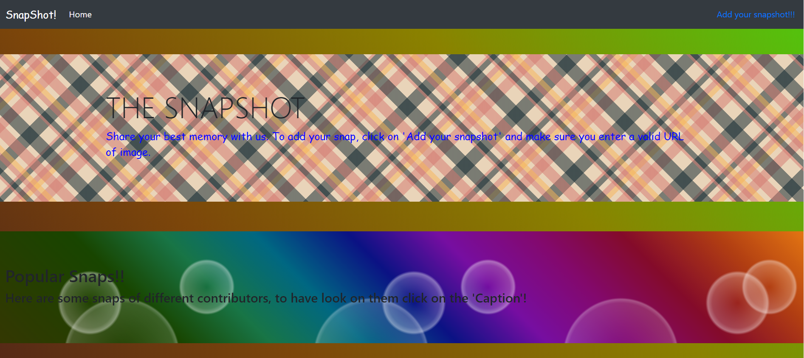

# SnapShot
 A website made using django, it stores and displays snapshots added by different contributors.
 User can add any photo but with valid URL and complete description.
 <h2> The first Page </h2>
 
 <h3> It's Working: </h3>
 

You can make as many submission to just my clicking 'add snapshot' and filling all fields with valid format.

